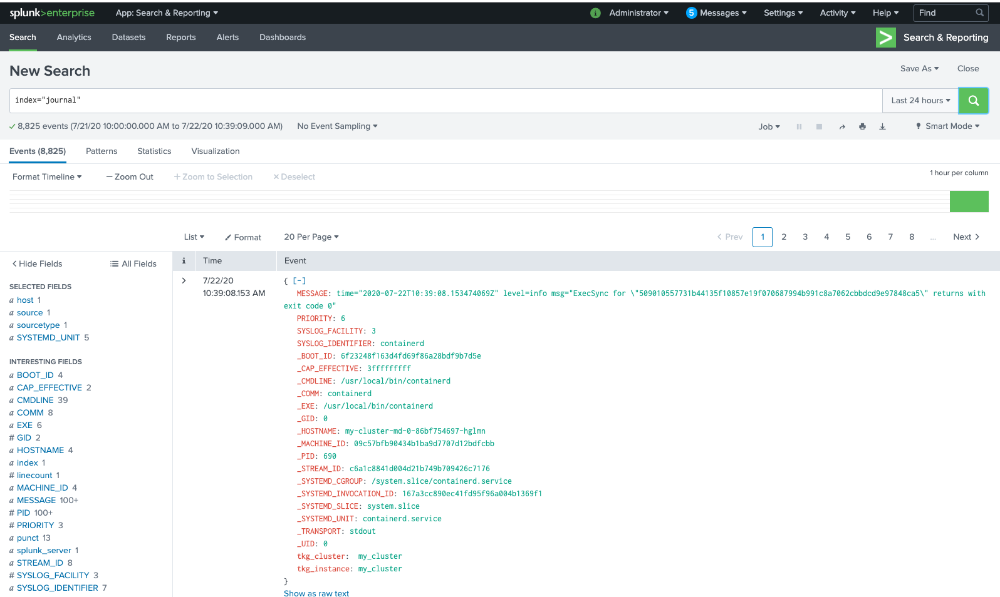

=  Logging in Kubernetes Cluster
                                        
Application and systems logs can help you understand what is happening inside your cluster.The easiest and most embraced logging method for containerize applications is to write to the standard output and standard error streams.This streams are redirected by conatainer engine to its configured location(as a standard /var/log/containers).

.In Kubernetes two kinds of logs are of interest.
- Component running as container
- Component running as non container

== Component running as container

**Control Plane**

Most of the control plane component are running as static pods

[source,shell]
ls  /etc/kubernetes/manifests/
    etcd.yaml
    kube-apiserver.yaml
    kube-controller-manager.yaml
    kube-scheduler.yaml

Above produces the logs as follows 
[source,shell]
ls  /var/log/containers/
    kube-apiserver-xxxxx.log
    kube-controller-manager-xxxxx.log
    kube-proxy-frc7q_kube-system_kube-proxy-xxxxx.log
    kube-scheduler-xxxxx.log
    etcd-xxx-control-plane-xxxxx.log
    audit.log(In case it is enabled ,depending upon it's setting.)

But this is not limited to the above log it depedns upon what pods are running on control plane nodes.

[source,shell]
ex:
calico-kube-controllers-XXXX_kube-system_calico-kube-controllers-XXXX.log
calico-node-XXXX_kube-system_calico-node-XXXX.log
calico-node-XXXX_kube-system_flexvol-driver-XXXX.log
calico-node-XXXX_kube-system_install-cni-XXXX.log
calico-node-XXXX_kube-system_upgrade-ipam-XXXX.log
coredns-XXXX_kube-system_coredns-XXXX.log
coredns-XXXX_kube-system_coredns-XXXX.log
fluent-bit-XXXX_tanzu-system-logging_fluent-bit-XXXX.log

[source,shell]
vsphere-cloud-controller-manager-dnkdm_kube-system_vsphere-cloud-controller-manager-3d395a6863e293c930e82fa14e94aa532729c62b94cc3a74577aaa1d80b4b414.log
vsphere-cloud-controller-manager-dnkdm_kube-system_vsphere-cloud-controller-manager-b0680fa26d450b949f2c22ad57d26dfe3c5bdcf586ebce6fb75be2759f8c2bc8.log
vsphere-csi-controller-0_kube-system_csi-attacher-5730eb78fd72777dd4651765d5cabc908194a829d5bc9ffeaf8d3383a9b29773.log
vsphere-csi-controller-0_kube-system_csi-provisioner-074e67d3d667fed209856a7703e5034f785a0fdc6f1a8ccd423b9e72a2b4193f.log
vsphere-csi-controller-0_kube-system_liveness-probe-cb1fed399dcb19cf5fdcb026bda0d75bc5caa5e6e3b07e960bcacff6b8f8448b.log
vsphere-csi-controller-0_kube-system_vsphere-csi-controller-4430c2f21e21b6e797e3db114b73700cd3f679a1bb85a9697c75be8915588160.log
vsphere-csi-controller-0_kube-system_vsphere-syncer-eefe007f9933b0014bfdc95b03c08859bdf5d30d95d56585196eccda9b2f1d3e.log
vsphere-csi-node-lqm5t_kube-system_liveness-probe-f2565f7ae13f27900f9627ae95ce004fa3a53b50b92dd2961325f31ee6365c4e.log
vsphere-csi-node-lqm5t_kube-system_node-driver-registrar-b9a32b8c07e9abfdd69834688bf859d1d1de8530745318530f1b6d251275aedf.log
vsphere-csi-node-lqm5t_kube-system_vsphere-csi-node-b3181daaaf4d76e6f52a14edacea8026c2884cc637d5c463c2dc6dee0ff55f2e.log

**Node**

This is where application are running as pods and logs are stored at /var/log/containers/ as per the configuration.

== Component running as non container

The kubelet and container runtime, for example containerd/Docker, do not run in containers.On machines with systemd,the kubelet and container runtime write to journald. If systemd is not present, they write .log files in the /var/log directory.

One can verify the logs as follows.
[source,shell]
    journalctl -u containerd.service
    journalctl -u kubelet.service

* By default journal are stored in /run/log/journal +
* In case of persistent journald ,this location can be in /var/log/journal depending upon configuration.

= Log collection in Kubernetes Cluster

As I explained in my previous section how the logs generated by applications running in containers/Pods and logs produced by journald on nodes.One can implement some sort of logging agent which is running on all the nodes having access to log directories and collects logs from these directory and sending it to some kind of log storage.Most of the logging agent provided by different vendors are implemented as Daemonset.
    One such agent is link:https://docs.fluentbit.io/manual/installation/kubernetes[Fluent Bit]

.Fluent Bit Log collection and Forwarding.
image:fluentbit.png[
"My screenshot",width=528,
link="fluentbit.png"]

.It provides the following artifacts.
- link:https://raw.githubusercontent.com/fluent/fluent-bit-kubernetes-logging/master/output/elasticsearch/fluent-bit-configmap.yaml[ConfigMap] :This is where INPUT (from where log is collected) and OUTPUT (to where log is forwarded) is defined.
- link:https://raw.githubusercontent.com/fluent/fluent-bit-kubernetes-logging/master/output/elasticsearch/fluent-bit-ds.yaml[DaemonSet] :This consist of Fluent Bit DaemonSet definition.

== Defining INPUT in configMap

.1.Different link:https://docs.fluentbit.io/manual/pipeline/inputs[Input Plugins] are provided by Fluent Bit.In the example below ,following Input plugins are used.
- **Tail:** It allows to monitor one or several text files. It has a similar behavior like tail -f shell command.
- **systemd:** It allows to collect log messages from the Journald daemon on Linux environments. 

.2.Tag:Every Event that gets into Fluent Bit gets assigned a Tag. This tag is an internal string that is used in a later stage by the Router to decide which Filter or Output phase it must go through.In the following examples two different tags are used .
- kube.*
- journal.*

=== Container Logs Stored at /var/log/containers

[source,shell]
  input-kubernetes.conf: |
    [INPUT]
        Name              tail
        Tag               kube.*
        Path              /var/log/containers/*.log
        Parser            docker
        DB                /var/log/flb_kube.db
        Mem_Buf_Limit     5MB
        Skip_Long_Lines   On
        Refresh_Interval  10

=== Logs from journald

[source,shell]
  input-journald.conf: |
    [INPUT]
        Name              systemd
        Tag               journal.*
        Path              /run/log/journal
        Parser            docker
        DB                /var/log/flb_kube.db
        Mem_Buf_Limit     5MB
        Skip_Long_Lines   On

= Log forwarding from Fuent Bit to Splunk

== Installing Splunk 
Following setting are only for learning/testing prupose.For production setting please check the official document of link:https://docs.splunk.com/[splunk] 

[source,shell]
kubectl create ns splunk
kubectl -n splunk run splunk  --image=splunk/splunk:latest --env=SPLUNK_START_ARGS=--accept-license --env=SPLUNK_PASSWORD=Splunk@123456
kubectl expose pod splunk --port=8000 --name=splunk-admin -n splunk
kubectl -n splunk port-forward service/splunk-admin 8000

== Configure Splunk
. http://localhost:8000
. Login with admin/Splunk@123456
. Go to on settings-->indexes 
. create two new index(ex:journal & kube) for events with default
. Go to settings-->Data inputs-->HTTP Event Collector
. Create two New Token-->Specify name of token(ex:journal and kube)-->Next-->Select Allowed Index-->Review-->Submit
. Get your token values and replace it in the following definition as Splunk_Token
. Go to settings-->Data inputs-->HTTP Event Collector
. Go to Global setting,make sure it is enabled.Check the port number
. Default is 8088 

. Create a service for HTTP Event Collector based on HTTP Port Number in Global Setting
[source,shell]
kubectl expose pod splunk --port=8088 --name=splunk-hec -n splunk

== Defining OUTPUT in configMap

. **Output to splunk on two different indexes.** +
Output to splunk can be forwarded at two different indexes.One for journal and for all the pods logs.

  output-splunk.conf: |
    [OUTPUT]
        Name           splunk
        Match          journal.*
        Host           splunk-hec.splunk.svc.cluster.local
        Port           8088
        Splunk_Token   be1ff375-5b8e-4c40-830d-bf779886f1e3
        TLS            On
        TLS.Verify     Off
    [OUTPUT]
        Name           splunk
        Match          kube.*
        Host           splunk-hec.splunk.svc.cluster.local
        Port           8088
        Splunk_Token   98706938-a99d-459f-9255-ca7e192d05a9
        TLS            On
        TLS.Verify     Off

. **Output to splunk on single indexes.** +
All the output to splunk can be forwarded on single index.

  output-splunk.conf: |
    [OUTPUT]
        Name           splunk
        Match          *
        Host           splunk-hec.splunk.svc.cluster.local
        Port           8088
        Splunk_Token   be1ff375-5b8e-4c40-830d-bf779886f1e3
        TLS            On
        TLS.Verify     Off

== Applying kubernets configMap and Daemonset definition.

[source,shell]
kubectl apply -f fluent-bit-configmap.yaml
kubectl apply -f fluent-bit-ds.yaml
kubectl logs -l k8s-app=fluent-bit-logging

On successful deployment ,log entries looks like as follows.
[source,shell]
[2020/07/09 17:47:47] [ info] [filter_kube] API server connectivity OK
[2020/07/09 17:47:48] [ info] [http_server] listen iface=0.0.0.0 tcp_port=2020
[2020/07/09 17:47:48] [ info] [sp] stream processor started

== Viewing logs in Splunk

. http://localhost:8000
. Go to App:Search & Reporting
. Search for index="journal" 
. Search for index="kube" 

