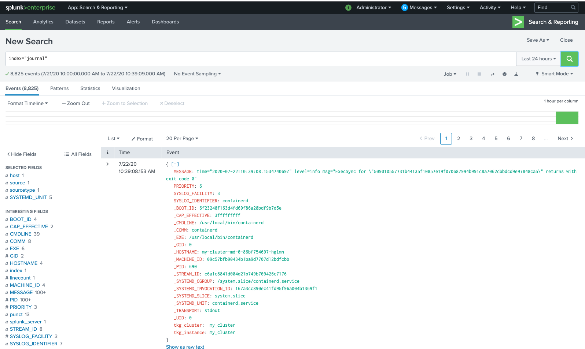

== Installing Splunk 
Following setting are only for learning/testing prupose.For production setting please check the official document of link:https://docs.splunk.com/[splunk] 

[source,shell]
kubectl create ns splunk
kubectl -n splunk run splunk  --image=splunk/splunk:latest --env=SPLUNK_START_ARGS=--accept-license --env=SPLUNK_PASSWORD=Splunk@123456
kubectl expose pod splunk --port=8000 --name=splunk-admin -n splunk
kubectl -n splunk port-forward service/splunk-admin 8000

== Configure Splunk
. http://localhost:8000
. Login with admin/Splunk@123456
. Go to on settings-->indexes 
. create two new index(ex:journal & kube) for events with default
. Go to settings-->Data inputs-->HTTP Event Collector
. Create two New Token-->Specify name of token(ex:journal and kube)-->Next-->Select Allowed Index-->Review-->Submit
. Get your token values and replace it in the following definition as Splunk_Token
. Go to settings-->Data inputs-->HTTP Event Collector
. Go to Global setting,make sure it is enabled.Check the port number
. Default is 8088 

. Create a service for HTTP Event Collector based on HTTP Port Number in Global Setting
[source,shell]
kubectl expose pod splunk --port=8088 --name=splunk-hec -n splunk

== Installing Fluentbit
Install it from binaries and doc from TKG 
 
== Defining OUTPUT in configMap

. **Output to splunk on two different indexes.** +
Output to splunk can be forwarded at two different indexes.One for journal and for all the pods logs.

  output-splunk.conf: |
    [OUTPUT]
        Name           splunk
        Match          journal.*
        Host           splunk-hec.splunk.svc.cluster.local
        Port           8088
        Splunk_Token   be1ff375-5b8e-4c40-830d-bf779886f1e3
        TLS            On
        TLS.Verify     Off
    [OUTPUT]
        Name           splunk
        Match          kube.*
        Host           splunk-hec.splunk.svc.cluster.local
        Port           8088
        Splunk_Token   98706938-a99d-459f-9255-ca7e192d05a9
        TLS            On
        TLS.Verify     Off

. **Output to splunk on single indexes.** +
All the output to splunk can be forwarded on single index.

  output-splunk.conf: |
    [OUTPUT]
        Name           splunk
        Match          *
        Host           splunk-hec.splunk.svc.cluster.local
        Port           8088
        Splunk_Token   be1ff375-5b8e-4c40-830d-bf779886f1e3
        TLS            On
        TLS.Verify     Off

== Applying kubernets configMap and Daemonset definition.

[source,shell]
kubectl apply -f fluent-bit-configmap.yaml
kubectl apply -f fluent-bit-ds.yaml
kubectl logs -l k8s-app=fluent-bit-logging

On successful deployment ,log entries looks like as follows.
[source,shell]
[2020/07/09 17:47:47] [ info] [filter_kube] API server connectivity OK
[2020/07/09 17:47:48] [ info] [http_server] listen iface=0.0.0.0 tcp_port=2020
[2020/07/09 17:47:48] [ info] [sp] stream processor started

== Viewing logs in Splunk

. http://localhost:8000
. Go to App:Search & Reporting
. Search for index="journal" 
. Search for index="kube" 

